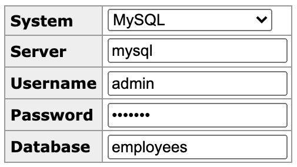

# MySQL


Deploys [MySQL](https://www.mysql.com/) with Datadog [DB monitoring](https://docs.datadoghq.com/database_monitoring/setup_mysql/selfhosted/?tab=mysql80) enabled.

MySQL will be deployed in the `mysql` namespace, which is automatically created.

```bash
kubectl apply -f mysql.yaml
```

You can also deploy [Adminer](https://www.adminer.org/), a full-featured database management tool.

```bash
kubectl apply -f mysql.yaml
```

It will be deployed in the `mysql` namespace and it should be accessable at `http://<cluster>:30080/adminer`.


